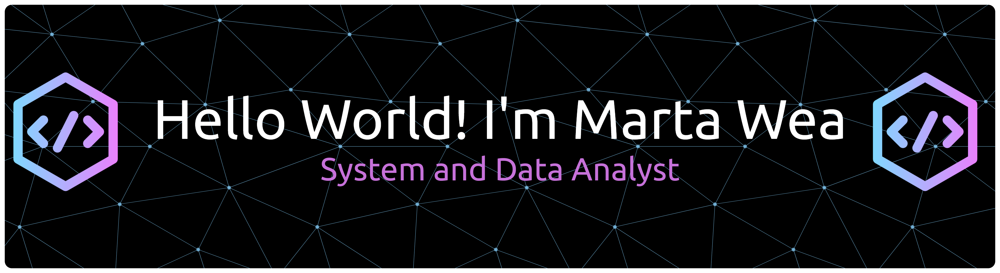

<!-- ## Hello World! I'm Marta Wea 👋 -->

##### Skills

  
  
  

  
  
  

  
  
  

  
  
  

##### Featured Project

### ⭐ **ETL Pipeline — SQL & Python** 

A complete Extract – Transform – Load (ETL) pipeline designed to move raw data from multiple sources (CSV, Excel, databases) into a clean, consolidated dataset ready for analysis and reporting.

Extract

✔ Extract the data from the CSV and load it into a pandas Dataframe

✔ Automated scheduled extraction using Python (Cron / Scheduler)

Transform

✔ Transform the data

✔ Standardizing date formats, data types, and naming conventions

✔ Duplicate detection & validation checks

✔ Applying business rules for categorization & segmentation

Load

✔ Create a database

✔ Load the tranform data into the database

✔ Implementing incremental loading (daily updates)

✔ Logging system for tracking process flow and identifying errors

Tools: Python (Pandas), PostgreSQL, MySQL
Skills: ETL Workflow, Automation, Data Cleaning, SQL Insert/Update Operations

---

### ⭐ **Supermarket Dashboard — Excel/Tableau**
Complete dashboard showing revenue, customer distribution, and product insights.  
**Tools:** Excel / Tableau  
**Skills:** Pivot Table, Power Query, Data Visualization  
🔗 *Project link coming soon*

---

### ⭐ **Python Data Cleaning — Pandas**
Cleaning large raw datasets with Pandas.  
**Tools:** Python  
**Skills:** Data wrangling, missing value handling, outlier detection  
🔗 *Project link coming soon*

##### Connect with me

  
  
  

##### My Github Stats

<!--
**mawemarta/mawemarta** is a ✨ _special_ ✨ repository because its `README.md` (this file) appears on your GitHub profile.

Here are some ideas to get you started:

- 🔭 I’m currently working on ...
- 🌱 I’m currently learning ...
- 👯 I’m looking to collaborate on ...
- 🤔 I’m looking for help with ...
- 💬 Ask me about ...
- 📫 How to reach me: ...
- 😄 Pronouns: ...
- ⚡ Fun fact: ...
-->
